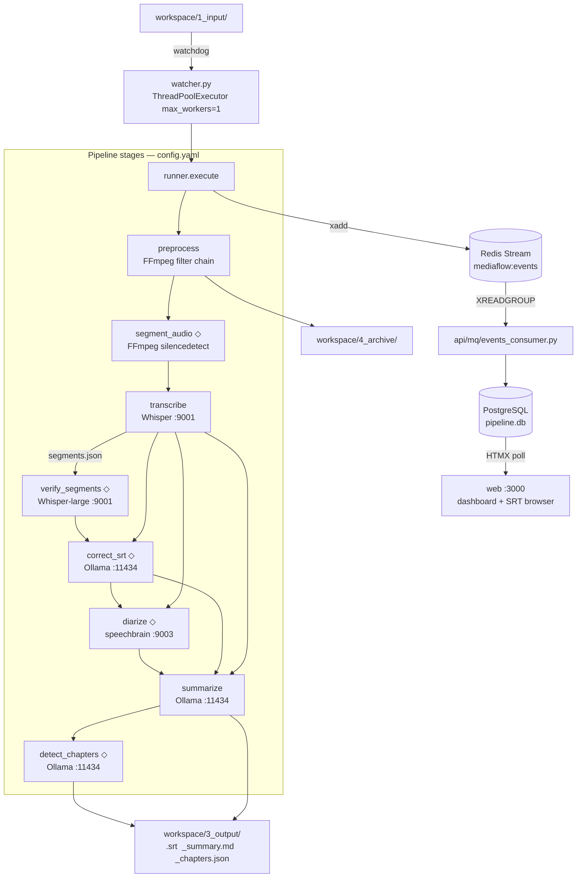

# mediaflow — Claude Handoff Guide

Audio recording pipeline that converts recordings into transcripts and structured summaries, served via a web dashboard. Built for a Mac mini running Apple Silicon + Docker.

---

## System Architecture

```
[Host — native, Apple Silicon GPU-bound]
  pipeline/watcher.py
    ├── watches workspace/1_input/ (watchdog)
    ├── runs FFmpeg → Whisper → Ollama per file (ThreadPoolExecutor, max_workers=1)
    └── publishes events to Redis Streams after each stage

  External services (must be running before pipeline starts):
    Whisper HTTP service  localhost:9001   (mlx-community/whisper-medium-mlx via ctl.sh)
    Ollama               localhost:11434   (model configured in config.yaml)

                    ↕ Redis Streams (mediaflow:events)

[Docker Compose — api + web + postgres + redis + minio + monitoring]
  postgres  port 5432   — primary DB (tasks, events tables)
  redis     port 6379   — event stream MQ
  minio     port 9000   — object storage for uploaded audio + output backups
  api       port 8080   — FastAPI: Redis consumer + REST endpoints
  web       port 3000   — Jinja2 + HTMX: dashboard + SRT browser
  grafana   port 3001   — metrics dashboard (Prometheus + OTel)
```

**Why this split**: Whisper (mlx-whisper) and Ollama use Apple Silicon GPU and cannot run inside Docker. The API + Web layer is fully portable.

**Why max_workers=1**: Two concurrent Whisper requests OOM-killed the process (whisper-medium-mlx peak ~6GB VRAM). Single worker is stable.

**Event flow**: pipeline → Redis xadd → `api/mq/events_consumer.py` reads via XREADGROUP → writes to PostgreSQL → web polls `/status/` via HTMX.


*◇ = disabled by default; enable in config.yaml*

---

## Workspace Layout

```
workspace/
  1_input/       ← drop audio/video files here to start processing
  2_processing/  ← FFmpeg WAV intermediates ({stem}_clean.wav, {stem}_chunks/)
  3_output/      ← final SRT, _summary.md, _summary.json
  4_archive/     ← original input files after successful pipeline

models/          ← ML model files (gitignored); download via scripts/download-models.sh
  bd.rnnn        ← RNNoise general-purpose model
  lq.rnnn        ← RNNoise low-quality-mic / far-field model
```

`{stem}_chunks/` is created by `segment_audio` stage and deleted automatically on pipeline success.
Files that fail are renamed to `{original}.failed` in-place so the watcher skips them on restart.

---

## Key Files

```
pipeline/
  watcher.py          — watchdog loop + startup recovery scan + ThreadPoolExecutor
  runner.py           — shared stage executor (ctx dict protocol, STAGE_RUNNERS registry)
  stages.py           — all stage functions: preprocess / segment_audio / transcribe /
                        verify_segments / correct_srt / diarize / summarize / detect_chapters
  prompts.py          — loader for pipeline/prompts.yaml
  prompts.yaml        — all Ollama prompt templates (git-tracked; edit to tune)
  rerun.py            — CLI: --stem / --from-stage re-run via runner.execute()
  worker.py           — Redis jobs queue consumer (MinIO download → watcher handoff)
  telemetry.py        — OpenTelemetry metrics setup
  providers/          — provider abstractions: WhisperProvider, LLMProvider, DiarizeProvider
  mq/publisher.py     — Redis xadd wrapper (EventPublisher)
  config.py           — load config.yaml + workspace path helper
  lifecycle.py        — parse retention strings; scan_and_expire for 2_processing/

api/
  main.py             — FastAPI lifespan: init DB pool, reconcile, start Redis consumers
  db/                 — PostgreSQL via asyncpg: __init__.py, queries.py, migrations/
  mq/
    events_consumer.py — XREADGROUP loop: mediaflow:events → process_event() → xack
    jobs_consumer.py   — XREADGROUP loop: mediaflow:jobs → download from MinIO → queue
  services/
    event_processor.py — shared process_event() (HTTP route + Redis consumer both call this)
    reconcile.py       — on startup, scan 3_output/*.srt and fill DB gaps
    webhook.py         — fire-and-forget POST on task.completed / task.failed
    dag.py             — DAG execution service
    correction.py      — SRT correction service
    project.py         — project management service
  routes/
    events.py          — POST /events/stage-complete (HTTP fallback)
    files.py           — GET /files/ list, /files/{stem}/srt, /files/{stem}/segments, /audio
    status.py          — GET /status/ for dashboard data
    stats.py           — GET /stats/ analytics (speaker bar, keyword trends)
    jobs.py            — job queue routes
    upload.py          — multipart upload to MinIO
    clip.py            — speaker clip extraction
    correction.py      — SRT correction routes
    dag_callback.py    — DAG callback handler
  utils/
    srt.py             — SRT parser + segment search + highlight
    minio.py           — MinIO client wrapper
    lifecycle.py       — retention string parser (API-side, no pipeline imports)
    cleanup.py         — async 3_output/ expiry loop

web/
  main.py             — FastAPI serving Jinja2 templates, calls api via httpx
  templates/
    dashboard.html    — HTMX live poll (/partial/status every 30s)
    srts.html         — SRT file list
    srt_viewer.html   — transcript viewer with search + highlight + audio player
    partials/
      jobs.html       — job queue partial

scripts/
  ctl.sh              — unified service control: start/stop/restart/rebuild/logs/status
  download-models.sh  — download RNNoise .rnnn model files into models/

config.yaml           — gitignored; copy from config.yaml.example
docker-compose.yml    — all Docker services: api + web + postgres + redis + minio + monitoring

diarize/
  service.py          — FastAPI diarization service on :9003; speechbrain ECAPA-TDNN + sklearn
  requirements.txt    — Apache 2.0 deps only; no HuggingFace token required (separate venv)

monitoring/
  prometheus.yml      — scrape config
  grafana/            — dashboards + provisioning
  gpu_exporter.py     — Apple Silicon GPU metrics exporter
```

---

## Configuration (`config.yaml`)

```yaml
pipeline:
  workspace_dir: ./workspace
  supported_formats: [.mp4, .m4a, .mp3, .wav, .flac]
  recording_type: auto          # auto | course | meeting | general
  # stop_after_stage: transcribe
  stages:
    - id: preprocess
      enabled: true
    - id: segment_audio
      enabled: false            # split long audio at silence boundaries before Whisper
    - id: transcribe
      enabled: true
    - id: verify_segments
      enabled: false            # re-transcribe low-confidence segments with whisper-large-v3
    - id: correct_srt
      enabled: false            # Ollama homophone correction pass
    - id: diarize
      enabled: false            # speaker diarization via speechbrain :9003
    - id: summarize
      enabled: true
    - id: detect_chapters
      enabled: false

# segment_audio stage config (only used when enabled above)
segment_audio:
  min_audio_duration: 600       # skip chunking for files shorter than this (seconds)
  max_chunk_duration: 300       # target max chunk size (seconds)
  silence_noise_db: -40         # dB threshold for silence detection
  min_silence_duration: 0.5     # minimum silence length to be a valid split point

preprocessing:
  vocal_separation: false       # Demucs htdemucs vocal separation (CPU, ~2-3x realtime)
  silence_threshold_db: -50     # silenceremove cutoff; lower to -60 for far-field audio
  # rnnoise_model: models/bd.rnnn   # neural denoising; recommended for noisy/far-field recordings
  # rnnoise_model: models/lq.rnnn   # alternative: low-quality-mic model

whisper:
  service_url: http://localhost:9001
  language: zh
  initial_prompt: ""            # warm-up vocabulary for domain terms

ollama:
  service_url: http://localhost:11434
  model: llama3

redis:
  host: localhost
  port: 6379
  stream_key: mediaflow:events
  consumer_group: api-consumers

lifecycle:
  wav:          immediate       # delete _clean.wav after transcription
  archive:      30d
  output:       forever

postgres:
  host: localhost
  port: 5432
  database: mediaflow
  user: mediaflow
  password: changeme

minio:
  endpoint: localhost:9000
  access_key: mediaflow
  secret_key: changeme
  input_bucket: mediaflow-input
  output_bucket: mediaflow-output
```

---

## External Service APIs

### Whisper (`pipeline/stages.py: _call_whisper()`)

```python
# POST /transcribe_segments
httpx.post(
    "http://localhost:9001/transcribe_segments",
    files={"audio": (audio_path.name, file_handle)},
    params={"language": "zh"},
    timeout=1800.0,
)
# Response: {"segments": [{"id", "start", "end", "text", "avg_logprob", "no_speech_prob"}]}
```

Model: `mlx-community/whisper-medium-mlx` (set via `WHISPER_MODEL` env in `ctl.sh`).
Also available: `/transcribe_large` (whisper-large-v3) used by `verify_segments`.

### Ollama (`pipeline/stages.py: summarize()`)

```python
import ollama
resp = ollama.chat(model="llama3", messages=[{"role": "user", "content": prompt}])
text = resp["message"]["content"]
```

### FFmpeg (`pipeline/stages.py: preprocess()`)

Filter chain (built dynamically from config):
```
aformat=channel_layouts=mono:sample_rates=16000
highpass=f=80
afftdn=nf=-25
anlmdn=s=7:p=0.002:r=0.002:m=15
[arnndn=m=models/bd.rnnn]          ← inserted here if preprocessing.rnnoise_model is set
speechnorm=e=12.5:r=0.00001:l=1
equalizer=f=1500:width_type=o:width=2:g=3
loudnorm=I=-16:TP=-1.5:LRA=11
dynaudnorm=f=200:g=11:p=0.95:m=5.0
silenceremove=start_periods=1:start_silence=0.5:start_threshold={silence_threshold_db}dB
```
Output: 16kHz mono WAV. Threshold configurable; RNNoise optional (zero extra deps, FFmpeg built-in).

### Diarization Service (`pipeline/stages.py: diarize()`)

**No HuggingFace token needed.** speechbrain ECAPA-TDNN (~200 MB) downloads on first request.
**MPS disabled** (speechbrain bug) — runs on CPU, ~100% CPU load during diarization.

Start: `bash scripts/ctl.sh start diarize`

```python
httpx.post(
    "http://localhost:9003/diarize",
    files={"audio": (audio_path.name, file_handle)},
    data={"segments": json.dumps([{"start": 1.0, "end": 3.5}, ...])},
    params={"num_speakers": 2},   # optional
    timeout=600.0,
)
# Response: {"segments": [{"speaker": "SPEAKER_00", "start": 1.0, "end": 3.5}, ...]}
```

---

## Redis Streams Schema

Stream key: `mediaflow:events` / Consumer group: `api-consumers`

```python
{"event": "task.submitted",  "stem": "lesson01", "filename": "lesson01.m4a", "ts": "..."}
{"event": "stage.started",   "stem": "lesson01", "stage": "preprocess",      "ts": "..."}
{"event": "stage.completed", "stem": "lesson01", "stage": "transcribe",      "output_path": "...", "ts": "..."}
{"event": "task.completed",  "stem": "lesson01", "output_path": "...",        "ts": "..."}
{"event": "task.failed",     "stem": "lesson01", "error_msg": "...",          "ts": "..."}
```

---

## Database Schema (PostgreSQL)

Migrations in `api/db/migrations/`. Applied automatically on API startup.

```sql
CREATE TABLE tasks (
    stem            TEXT PRIMARY KEY,
    filename        TEXT,
    status          TEXT NOT NULL DEFAULT 'submitted',
    current_stage   TEXT,
    submitted_at    REAL,
    started_at      REAL,
    completed_at    REAL,
    duration_sec    REAL,
    error_msg       TEXT,
    output_srt_path TEXT
);

CREATE TABLE events (
    id      SERIAL PRIMARY KEY,
    stem    TEXT NOT NULL,
    event   TEXT NOT NULL,
    stage   TEXT,
    status  TEXT,
    ts      REAL,
    payload TEXT
);
```

---

## How to Run (Development)

```bash
# 1. Copy and edit config
cp config.yaml.example config.yaml

# 2. Download ML models (RNNoise — optional but recommended for noisy recordings)
bash scripts/download-models.sh

# 3. Start all services (Docker + Whisper + watcher)
bash scripts/ctl.sh start all
# Web: http://localhost:3000   API: http://localhost:8080

# 4. Drop a file to test
cp some_recording.m4a workspace/1_input/
```

Whisper model is set in `ctl.sh` via `WHISPER_MODEL=mlx-community/whisper-medium-mlx`.
Ollama must be running separately: `ollama serve` + `ollama pull <model>`.

### Service Control (`scripts/ctl.sh`)

```bash
bash scripts/ctl.sh status                  # overview of all services + health
bash scripts/ctl.sh start  [all|docker|whisper|watcher|diarize]
bash scripts/ctl.sh stop   [all|docker|whisper|watcher|diarize]
bash scripts/ctl.sh restart [all|api|web|watcher|whisper|diarize]
bash scripts/ctl.sh rebuild [all|docker|api|web]
bash scripts/ctl.sh logs   [api|web|redis|watcher|whisper|diarize]
```

`diarize` must be started explicitly — it's optional and loads a heavy model.

### Python Environment

```bash
python3 -m venv venv
source venv/bin/activate
pip install -r requirements.txt
```

Always activate venv before running pipeline Python directly.

### Smoke Test (End-to-End Verification)

```
tests/
  fixtures/test-speech.m4a   — macOS TTS (Meijia voice), 25s, ~316KB
  run-pipeline-test.sh       — drops the file, polls watcher.log, checks outputs
```

```bash
bash tests/run-pipeline-test.sh
```

Expected:
```
✓  Pipeline completed (20-30s)
  ✓  SRT transcript
  ✓  Summary markdown
  ✓  Summary JSON
  ✓  Archived original
  ✓  SRT has content (>10 lines)
=== Result: 5 passed, 0 failed ===
```

Polls `data/logs/watcher.log` (not the API) — immune to stale DB state on re-runs.

### Useful Commands

```bash
# Re-run from a specific stage (WAV must exist in 2_processing/ for transcribe+)
source venv/bin/activate
python -m pipeline.rerun --stem lesson01 --from-stage transcribe
python -m pipeline.rerun --stem lesson01 --from-stage summarize

# Watch logs live
bash scripts/ctl.sh logs watcher
bash scripts/ctl.sh logs api

# Rebuild Docker images after code change
bash scripts/ctl.sh rebuild api

# Check API health + pipeline status
curl http://localhost:8080/health
curl http://localhost:8080/status/ | python3 -m json.tool

# Watch Redis stream live
redis-cli XREAD COUNT 10 STREAMS mediaflow:events 0
```

---

## Implementation Status

### ✅ Done

| Item | File |
|------|------|
| Config centralisation | `config.yaml` + `pipeline/config.py` |
| Docker Compose (api + web + postgres + redis + minio + monitoring) | `docker-compose.yml` |
| Pipeline → Redis → API event bridge | `pipeline/mq/publisher.py`, `api/mq/events_consumer.py` |
| PostgreSQL state table + async queries | `api/db/` |
| Startup file scan + API reconcile | `pipeline/watcher.py`, `api/services/reconcile.py` |
| Error isolation (.failed suffix) | `pipeline/watcher.py` |
| Dashboard (HTMX live poll) | `web/templates/dashboard.html` |
| SRT browser + full-text search | `web/templates/srts.html`, `srt_viewer.html` |
| Audio player in SRT viewer (click-to-seek) | `web/templates/srt_viewer.html` |
| Webhook notification on completion | `api/services/webhook.py` |
| Stage incremental re-run (`--from-stage`) | `pipeline/rerun.py` |
| Smoke test + fixture audio | `tests/fixtures/test-speech.m4a`, `tests/run-pipeline-test.sh` |
| Recording-type prompts + LLM correction | `pipeline/stages.py` (`correct_srt`), `pipeline/prompts.yaml` |
| DAG stage runner | `pipeline/runner.py` |
| Segment verification (whisper-large-v3) | `pipeline/stages.py` (`verify_segments`) |
| Chapter detection | `pipeline/stages.py` (`detect_chapters`), `pipeline/prompts.yaml` |
| Speaker diarization (speechbrain, Apache 2.0) | `diarize/service.py`, `pipeline/stages.py` (`diarize`) |
| Speaker enrollment (voiceprint library) | `diarize/service.py`, `pipeline/enroll.py` |
| MinIO object storage integration | `api/utils/minio.py`, `pipeline/minio_io.py` |
| Provider abstraction (Whisper / LLM / Diarize) | `pipeline/providers/` |
| Analytics panel (stats + speaker bar + keywords) | `api/routes/stats.py` |
| Grafana monitoring stack | `monitoring/`, `docker-compose.yml` |
| Unified service control script | `scripts/ctl.sh` |
| **segment_audio stage** — silence-boundary chunking before Whisper | `pipeline/stages.py`, `pipeline/runner.py` |
| **RNNoise denoising** — optional arnndn via FFmpeg (far-field / noisy audio) | `pipeline/stages.py`, `scripts/download-models.sh` |
| **Configurable silenceremove threshold** — tune for far-field recordings | `pipeline/stages.py`, `config.yaml.example` |

### ❌ Not Yet Implemented

Nothing remaining — all planned phases complete.

---

## Coding Conventions

- **No comments** unless the WHY is non-obvious. Never narrate what the code does.
- **Blocking functions** (FFmpeg subprocess, httpx calls, ollama.chat) belong in `pipeline/stages.py` and must be called via the thread pool in `watcher.py`, never in async context.
- **Async functions** belong in `api/`. Use `asyncpg` for DB access via `api/db/`.
- **Event processing logic** lives in `api/services/event_processor.py`. Both the HTTP route (`api/routes/events.py`) and the Redis consumer (`api/mq/events_consumer.py`) call `process_event()` — do not duplicate logic between them.
- **No Redis on the API side except in `api/mq/`**. The rest of the API is Redis-unaware.
- **config.yaml is gitignored**. `config.yaml.example` is the committed template.
- **models/ is gitignored**. Run `bash scripts/download-models.sh` after cloning.
- Do not push to remote unless explicitly asked.

---

## Version Control (Trunk-Based Development)

Single `main` branch, always deployable. Current release: `v0.2.0`.

| Rule | Detail |
|------|--------|
| **`main` is always green** | Use a short-lived branch for multi-session or experimental work |
| **Small, atomic commits** | One logical change per commit |
| **Do not push unless asked** | User confirms each push explicitly |
| **No force-push to `main`** | Non-negotiable |

### Commit Message Format

```
<type>(<scope>): <one-line summary>

type: feat | fix | chore | docs | refactor | test
scope: pipeline | api | web | stages | diarize (optional)
```
